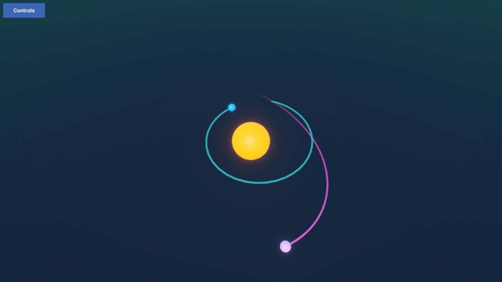
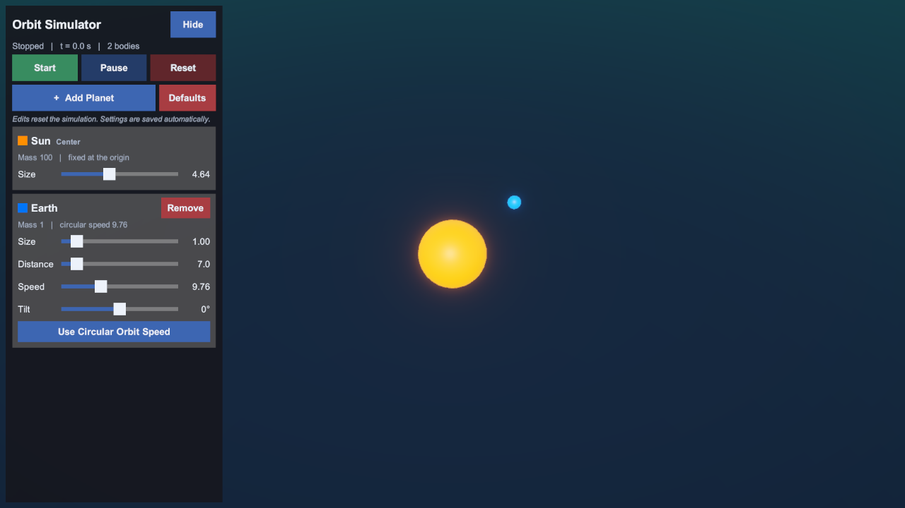
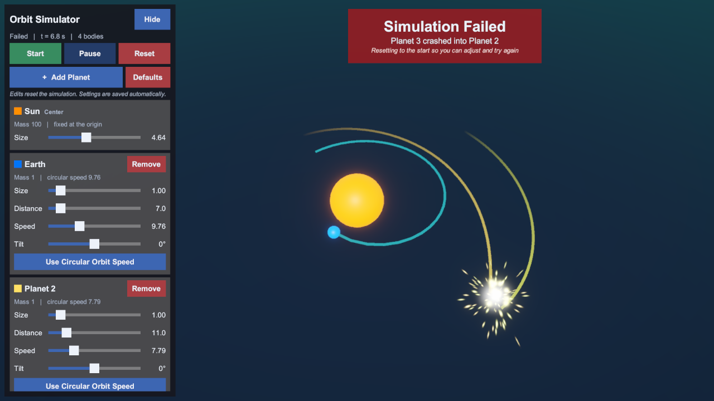

# Galaxy SIM

An interactive N-body orbit simulator built with Unity 6 and URP. You build a small solar system, set each planet's starting conditions, and watch gravity take over. Every body pulls on every other body. If two of them collide, the run fails with a burst effect and resets so you can adjust and try again.

It is designed for landscape phones (Android) and also works in the Editor with a mouse.



## Screenshots

| Control panel | Collision |
| --- | --- |
|  |  |

## Features

### Physics
- **N-body gravity**: every planet attracts every other planet using Newton's law, `F = G · m1 · m2 / r²`, applied in `FixedUpdate`.
- **A fixed central body**: the heaviest body (the Sun) stays at the origin and every orbiting planet is placed relative to it.
- **Mass follows size**: mass is `density · size^exponent`. With the default exponent of 3, mass grows with volume.
- **Circular orbit helper**: one tap sets a planet's speed to `√(G·M / r)`, the speed for a circular orbit at its current distance.
- **3D orbits**: a tilt slider moves a planet's starting velocity out of the horizontal plane, so you can make inclined orbits.
- **Smooth motion**: interpolated rigidbodies and continuous-speculative collision detection keep fast, small planets from tunnelling through each other.

### Simulation controls
- **Start, Pause, Reset**: pausing freezes every body and remembers its velocity, so resuming continues exactly where it stopped.
- **Add and remove planets**: new planets go just outside the outermost orbit, at circular-orbit speed and in a random color. They are spread out using the golden angle so they don't line up.
- **Live editing**: each planet has its own card with sliders for size, distance, speed and tilt. The Sun's card has a size slider. Changing a value resets the run to the new starting conditions.
- **Collision failure**: when two bodies touch, the simulation freezes, the colliding planets burst into sparks in their own colors, and a banner names what crashed (for example "Planet 3 crashed into Planet 2"). The run then resets on its own.
- **Orbit trails**: each planet leaves a colored trail behind it.

### Saving
- **Automatic saving**: your system is saved to `PlayerPrefs` shortly after you stop dragging a slider, and also when the app is paused or closed.
- **Defaults**: one button discards the saved setup and restores the scene's original system.

### Mobile
- **Touch camera**: drag with one finger to orbit the camera, pinch to zoom, and flick for momentum. With a mouse, drag to rotate and use the scroll wheel to zoom.
- **Mobile UI**: the layout fits inside the screen's safe area. The control panel can be hidden, and the Android back button toggles it.
- **Phone-friendly behavior**: the game targets 60 fps, and the screen stays awake while a simulation is running.

## Getting started

### Requirements
- Unity **6000.2.14f1** (Unity 6.2) or newer
- Universal Render Pipeline 17.2 and Input System 1.16, which load from the package manifest

### Run it
1. Clone the repository:
   ```bash
   git clone https://github.com/mmohsiondev38/Galaxy-Sim.git
   ```
2. Open the folder in Unity Hub.
3. Open `Assets/Scenes/Game.unity` and press **Play**.

### Build for Android
1. Go to **File → Build Profiles** and switch the platform to **Android**.
2. Make sure `Assets/Scenes/Game.unity` is in the scene list.
3. Select **Build** or **Build And Run**.

## How to play

1. Press **Start** to launch the planets from their starting positions.
2. Use **+ Add Planet** to add more bodies.
3. Adjust a planet's **Size**, **Distance**, **Speed** and **Tilt**. Use **Use Circular Orbit Speed** for a stable orbit to start from.
4. Keep the system stable. Any collision ends the run.
5. Press **Hide** to see the whole screen, then **Controls** to bring the panel back.

## Project structure

| Script | Responsibility |
| --- | --- |
| [`SimulationManager.cs`](Assets/Scripts/SimulationManager.cs) | Simulation states (stopped, running, paused, failed), starting conditions, adding and removing planets, collisions, saving and loading |
| [`Planet.cs`](Assets/Scripts/Planet.cs) | Rigidbody body that applies gravity to every other planet and reports collisions |
| [`SimulationUI.cs`](Assets/Scripts/SimulationUI.cs) | Control panel built in code: buttons, planet cards, sliders, failure banner, safe-area layout |
| [`CollisionBurst.cs`](Assets/Scripts/CollisionBurst.cs) | Flash and spark particles that are created once and reused for every collision |
| [`OrbitCameraMobile.cs`](Assets/Scripts/OrbitCameraMobile.cs) | Touch and mouse orbit camera with pinch zoom and momentum |
| [`OrbitCamera.cs`](Assets/Scripts/OrbitCamera.cs) | Simpler orbit camera driven by Input System actions |

### Tuning
Most values can be changed in the Inspector on the **Simulation** object:
- `SimulationManager`: density, mass exponent, new planet size and spacing, failure reset delay, target frame rate
- `SimulationUI`: slider ranges for size, distance, speed and tilt, panel width, reference resolution
- `Planet`: gravitational constant (`gravityConstant`, default `6.674`, scaled for Unity units)

## License

Released under the [MIT License](LICENSE).
